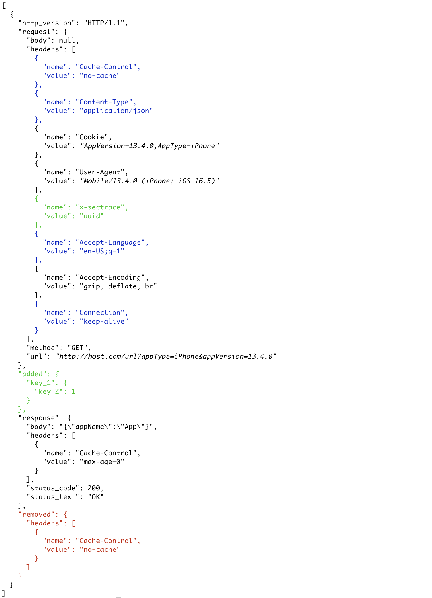

# delta
Quick JSON diff checker

### Usage
```shell
mix delta test/support/new.json test/support/current.json
```


where
- Red - removed keys
- Green - added keys
- Blue - reordered keys
- Italics - changed values only

Kindly be aware that if the current and new lists of JSON objects contain a different number of objects, an error will be triggered by the delta function.
This issue was found shortly before my holiday, and it should be quickly fixed after my return.

For correct work please keep one JSON object in JSON list for now. For example
```json
[ //one object in this list
  {
    "http_version": "HTTP/1.1",
    "request": {
      "body": null,
      "headers": [
        {
          "name": "Content-Type",
          "value": "application/json"
        },
        {
          "name": "Connection",
          "value": "keep-alive"
        },
        {
          "name": "Cookie",
          "value": "AppVersion=13.3.7;AppType=iPhone"
        },
        ...
      ],
      "method": "GET",
      "url": "url?appType=iPhone&appVersion=13.3.7",
      ...
    }
  }
]
```

Please refer to `new` and `current` json files in `test/support` folder.

### Known issues
- Parses json lists with different amount of objects incorrectly
- Headers order is incorrect

### On the todo
- Better objects highlighting
